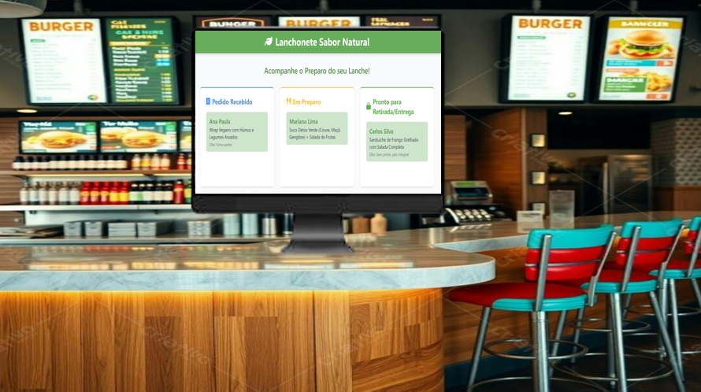
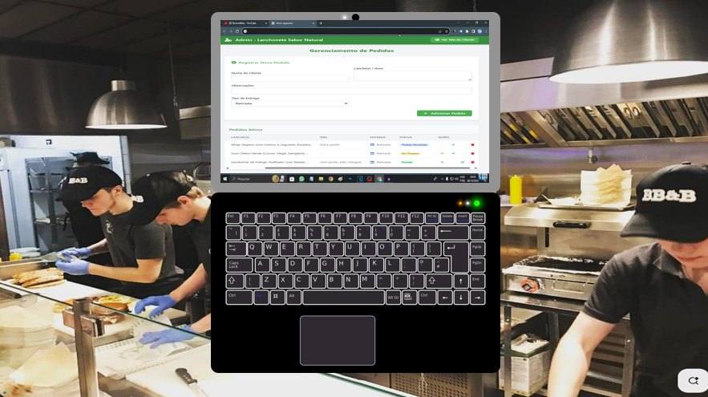
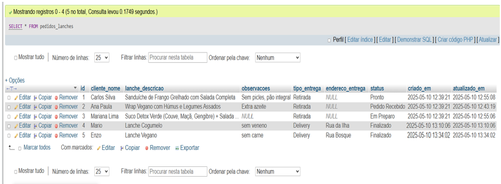

# 🍔 Lanchonete Sabor Natural - Sistema de Gerenciamento de Pedidos 🌿

Bem-vindo ao sistema de gerenciamento de pedidos da Lanchonete Sabor Natural! Este projeto full-stack permite que clientes acompanhem seus pedidos e que a equipe da lanchonete gerencie o fluxo de preparo.

✨ **Tecnologias Utilizadas:** ✨

*   **Frontend:** HTML, Tailwind CSS, Font Awesome, JavaScript (Vanilla)
*   **Backend:** Node.js, Express.js
*   **Banco de Dados:** MySQL
*   **Comunicação em Tempo Real:** Server-Sent Events (SSE)
*   **Hospedagem:** Render.com

---

## 🚀 Funcionalidades Principais

*   **Visão do Cliente:**
    *   Acompanhamento de pedidos em tempo real nas colunas:
        *   📝 Pedido Recebido
        *   👨‍🍳 Em Preparo
        *   🛍️ Pronto para Retirada/Entrega
*   **Visão Administrativa (Admin):**
    *   📝 Registro de novos pedidos (nome do cliente, descrição do lanche, observações, tipo de entrega).
    *   📋 Listagem de pedidos ativos com detalhes.
    *   🔄 Atualização de status dos pedidos (voltar e avançar no fluxo).
    *   ✔️ Marcação de pedidos como "Finalizado" (para histórico).
    *   🗑️ Exclusão de pedidos (para cancelamentos ou erros).
    *   📡 Atualizações em tempo real para todas as telas conectadas via SSE.

---

## 🌐 Deploy

Este projeto está configurado para deploy contínuo no [Render.com](https://render.com/).
Qualquer push para a branch `main` no GitHub irá acionar um novo build e deploy.
O banco de dados está hospedado em nuvem.

**Links para acessar a aplicação:**
* https://lanchonete-app.onrender.com/admin
* https://lanchonete-app.onrender.com/cliente

**Variáveis de Ambiente necessárias no Render:**
*   `DB_HOST`
*   `DB_USER`
*   `DB_PASSWORD`
*   `DB_DATABASE`
*   `DB_PORT`
*(A variável `PORT` é fornecida automaticamente pelo Render).*

---

## 🤔 Possíveis Melhorias Futuras

*   [ ] Autenticação para a área de Admin.
*   [ ] Sistema de cardápio para seleção de lanches.
*   [ ] Cálculo de preços.
*   [ ] Notificações mais ricas para o cliente (ex: som, pop-up).
*   [ ] Paginação para a lista de pedidos no Admin (se muitos pedidos).

---

  </a>

  </a>

  </a>

# Conheça também:

Um pesquisador de endereços por CEP em: https://jose-henrique-a.github.io/FormularioComAutoPreenchimentoPeloCEP/

Um personal trainer digital online em: https://josehenrique.pythonanywhere.com/

Uma calculadora de preço médio dos seus dólares investidos: https://jose-henrique-a.github.io/Preco-medio-dolar/

Uma aplicação para consumir uma API, gerenciador de contatos : https://jose-henrique-a.github.io/Gerendiador-de-Contatos/

Aplicação que cria API e disponibiliza através de um servidor : https://web-production-eedc.up.railway.app/

Uma aplicação para consumir uma API, gerenciador de produtos e preços : https://crud-produto-preco.netlify.app/

Aplicação que cria API e disponibiliza através de um servidor : https://api-produto-vercel.vercel.app/

Um blog de carros em: https://jose-henrique-a.github.io/Blog-da-Evolucao-dos-Carros/

Link para o app Versão Web: https://jose-henrique-a.github.io/APP-Flutter/ Banco de dados fica em seu navegador.

E aqui o link da versão aplicativo(APK) para Android, com banco de dados "dentro" do aplicativo. Clique e baixe direto no seu celular: https://drive.google.com/uc?export=download&id=1OKlwvRrfFhaCdTnMgXMBzG-yJm_Aa2dK 

Como este app está fora da Play Store, você precisa conceder permissões em seu celular para baixar aplicativos de fontes externas.